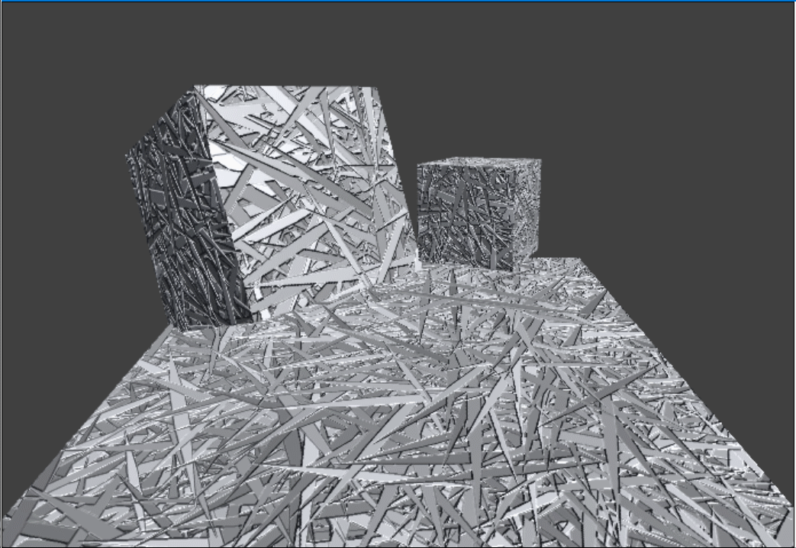
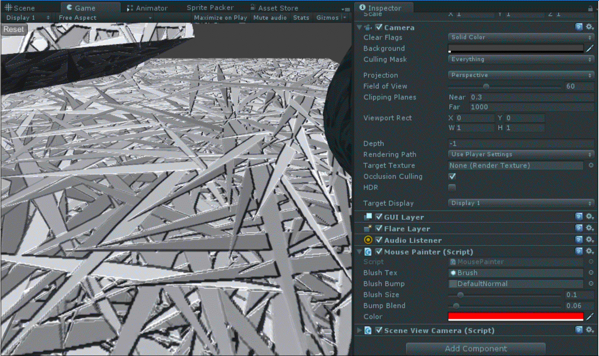

# UnityTexturePaint

テクスチャーペイントを実現するアセットです。

詳細は[こちら](http://esprog.hatenablog.com/entry/2016/06/04/145713)。

  

エフェクト盛ればこんなふうに使えます。

  

  

## できること

### 塗り

任意のゲームオブジェクトに対してペイント出来ます。

  

### ブラシ変更

ペイントのブラシ形状を任意に変更できます。

ブラシは自作可能です。

  

### ブラシに厚みをつける

ペイントのブラシに厚みをつけることが出来ます。

バンプマップで実現しているのでこちらも自作可能です。

  

## 使い方

  

1. 塗りたいゲームオブジェクトにDynamicCanvasコンポーネントを付ける
2. そのゲームオブジェクトについているコライダーがMeshColliderだけであることに注意する
3. 好きなタイミングでDynamicCanvas.Paintメソッドを呼ぶことでペイントできる(GIFではサンプル用のMousePainterスクリプトをカメラに付けている)
